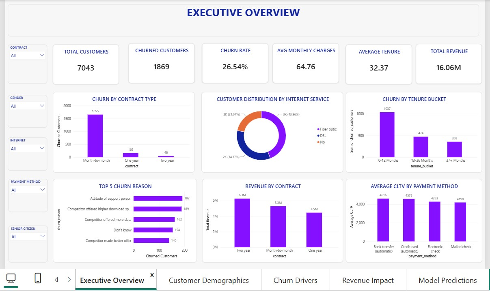
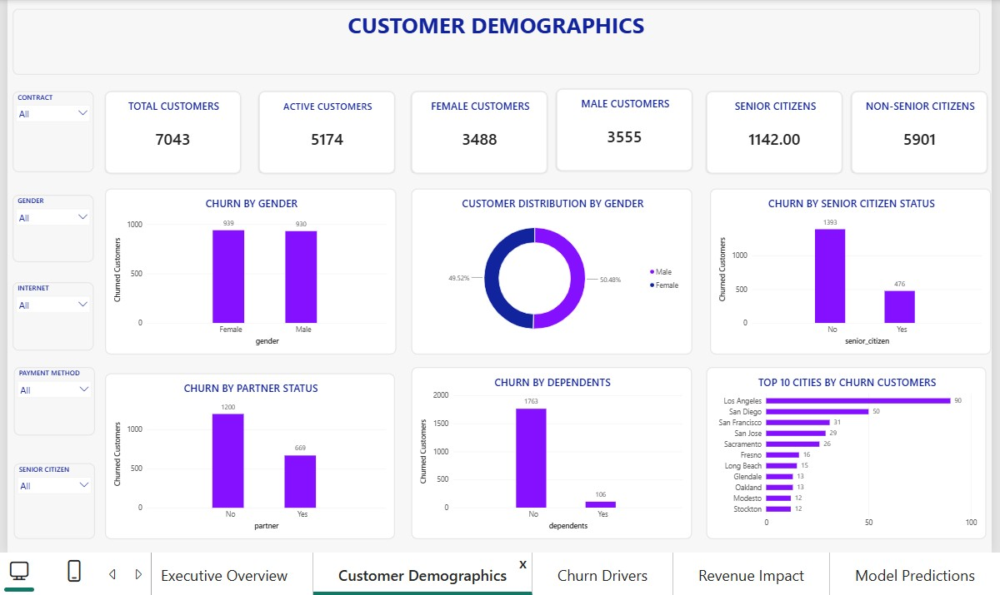
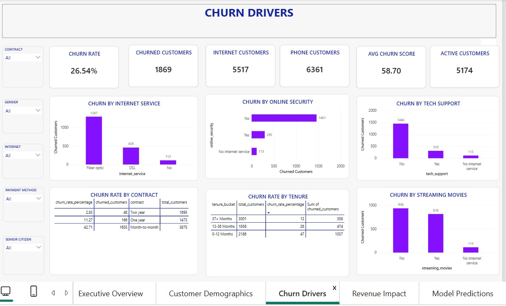
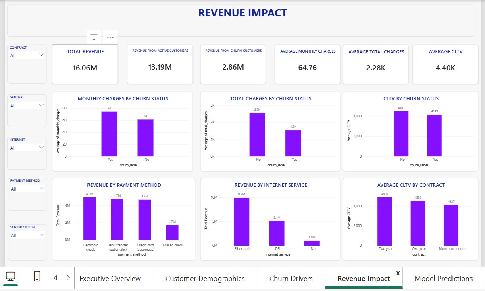
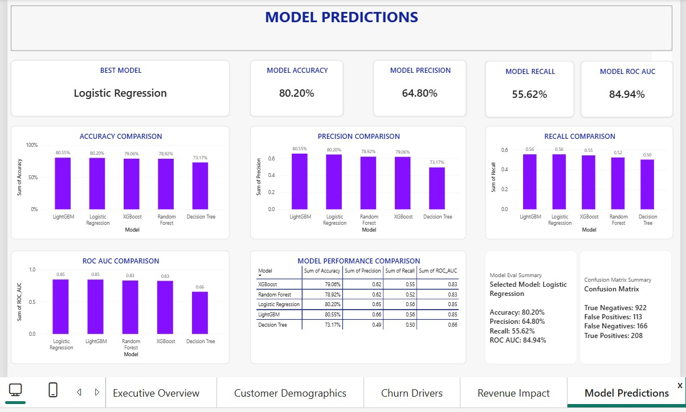

# Customer Churn Prediction BI Platform

## Joyce's Project Documentation

**Role:** Lead BI & Analytics Developer

**Project:** Customer Churn Prediction & BI Platform

**Primary Tool:** Microsoft Power BI

**Data Source:** SQLite / ODBC

**Repository:** Customer-Churn-Prediction-BI-Platform

**GitHub:** joyce-ai4health

---

## 1. Project Overview

The Customer Churn Prediction BI Platform was a collaborative end-to-end analytics project designed to help a telecommunications business identify customers who are likely to churn and turn analytical results into actionable business insights.

The complete project combined:

- Data ingestion and cleaning
- SQLite database development
- SQL analysis
- Feature engineering
- Machine learning model training and evaluation
- FastAPI prediction services
- Power BI business intelligence
- Business reporting
- Testing and validation

My primary contribution was the **Business Intelligence and Power BI dashboard development**.

---

## 2. My Role

I worked primarily on the **Power BI and Business Intelligence component** of the project.

My responsibilities included:

- Connecting Power BI to the project SQLite database through ODBC.
- Working with SQL views created by the SQL team.
- Building the five required Power BI dashboard pages.
- Creating DAX measures for dashboard KPIs.
- Connecting model evaluation results to the Model Predictions page.
- Developing business-focused visualizations.
- Writing dashboard insights and recommendations.
- Testing and validating dashboard results.
- Addressing issues identified during project review.
- Maintaining my GitHub branch and submitting the completed work through a Pull Request.

My assigned project task was **Issue #12 — Power BI Dashboard – 5 Pages via ODBC Connection – Joyce**.

---

## 3. Power BI Dashboard Development

I developed five dashboard pages:

### 3.1 Executive Overview

This page provides a high-level view of customer churn.

Key elements include:

- Total customers
- Overall churn rate
- Customer churn KPIs
- High-level business indicators
- Visual summaries of the customer base

### 3.2 Customer Demographics

This page examines churn across customer demographic groups.

The analysis includes:

- Gender
- Senior citizen status
- Partner status
- Dependents
- Other available demographic attributes

The purpose was to identify customer groups with noticeably different churn patterns.

### 3.3 Churn Drivers

This page investigates the major factors associated with customer churn.

The analysis includes:

- Contract type
- Tenure
- Internet service
- Technology support
- Online security
- Payment method
- Other relevant churn indicators

The dashboard showed particularly high churn among month-to-month customers and customers in their early tenure period.

### 3.4 Revenue Impact

This page connects customer churn to financial impact.

The analysis includes:

- Monthly charges
- Total charges
- Revenue associated with churned customers
- Comparison of churned and retained customers

This helped move the analysis from simply asking:

> "Who is churning?"

to:

> "What is the financial impact of that churn?"

### 3.5 Model Predictions

This page presents the performance of the machine learning models.

The dashboard compares:

- Logistic Regression
- LightGBM
- XGBoost
- Random Forest
- Decision Tree

Metrics include:

- Accuracy
- Precision
- Recall
- ROC AUC

The page also contains a model performance comparison and confusion-matrix information.

---

## Dashboard Screenshots

The completed dashboard consists of five pages:

### Executive Overview



### Customer Demographics



### Churn Drivers



### Revenue Impact



### Model Predictions



---
## 4. Technical Implementation

### SQLite + ODBC + Power BI

The dashboard was connected to the project's **SQLite database** through an **ODBC connection** and developed in **Microsoft Power BI**.

The data flow was:

```text
SQLite Database
      ↓
ODBC Connection
      ↓
Power BI
      ↓
SQL Views / Tables
      ↓
Power Query / Data Transformation
      ↓
DAX Measures
      ↓
Dashboard Visualizations
```

This setup allowed the dashboard to use data from the project's database and SQL views rather than relying on manually entered final dashboard values.

The Power BI dashboard included dynamic calculations and business intelligence visualizations based on the underlying project data.

## 5. DAX Development

An important part of the dashboard development was replacing hardcoded dashboard values with dynamic DAX logic.

For example, the **Best Model** was initially hardcoded as:

```DAX
Best Model = 
"Logistic Regression"
```

I replaced this with a dynamic measure that identifies the model with the highest ROC AUC:

```DAX
Best Model = 
CALCULATE(
    SELECTEDVALUE(model_comparison[Model]),
    TOPN(
        1,
        model_comparison,
        model_comparison[ROC_AUC],
        DESC
    )
)
```

This allows the dashboard to determine the best-performing model directly from the evaluation data rather than relying on a manually entered model name.

I also created dynamic measures for the **model evaluation summary** and **confusion matrix summary**, allowing the Model Predictions page to reflect the underlying evaluation results.

## 6. Dashboard Validation

I validated the completed dashboard to ensure that the required pages, visuals, calculations, and model evaluation results were working correctly.

Validation checks included:

- Confirming that the Power BI dashboard opened successfully.
- Confirming that all five required dashboard pages were present.
- Checking that dashboard visuals displayed correctly.
- Verifying that model comparison metrics matched the evaluation data.
- Checking that DAX measures returned the expected values.
- Confirming that the Best Model calculation updated dynamically based on ROC AUC.
- Checking that model evaluation information responded correctly to visual filtering.
- Confirming that final dashboard values were not manually entered or hardcoded.
- Re-testing the dashboard after implementing review feedback and updates.

The final dashboard was reviewed to ensure that it was functional, consistent with the underlying data, and ready for submission.

## 7. Challenges and Problem Solving

During dashboard development and review, I encountered several issues that required troubleshooting and adjustment.

### ODBC / Power BI Data-Type Issue

Some values from the SQL views were returned through the SQLite ODBC connection as text rather than numeric values.

This affected the use of churn-rate fields in Power BI calculations and visualizations.

I resolved the issue by converting the affected fields to the appropriate numeric data types in Power Query before using them in DAX and dashboard visuals.

### Model Evaluation Updates

The machine-learning evaluation results were updated during the project, which affected the model identified as the best-performing model.

To prevent the dashboard from depending on a manually entered model name, I implemented dynamic DAX logic that identifies the model with the highest ROC AUC from the model comparison data.

### Dashboard Review and Corrections

The dashboard went through a review process during development.

I implemented the requested corrections, re-tested the affected dashboard components, and verified the updated dashboard before committing the final Power BI file.

## 8. GitHub Collaboration

I used GitHub throughout the project to manage, version, and document my contribution.

My workflow included:

1. Working on my assigned dashboard branch.
2. Pulling the latest project changes before continuing development.
3. Updating the Power BI dashboard and supporting documentation.
4. Testing the dashboard locally.
5. Committing changes using descriptive commit messages.
6. Pushing changes to my GitHub branch.
7. Submitting the completed work through the project Pull Request.
8. Reviewing and applying feedback.
9. Committing and pushing the final reviewed changes.

The completed Power BI dashboard and supporting documentation were submitted through the project's Power BI Pull Request.

## 9. Business Insights

The dashboard analysis highlighted several important patterns associated with customer churn.

### Month-to-Month Customers

Month-to-month customers showed substantially higher churn than customers on longer-term contracts.

This indicates that contract type is an important churn-related factor and suggests that retention incentives or longer-term contract options could be considered for month-to-month customers.

### Early-Tenure Customers

Customers within their first year showed considerably higher churn.

This indicates that the early stage of the customer relationship is an important period for retention efforts.

### Technology Support and Online Security

Customers without technology support or online security showed higher churn rates.

This suggests that these services may be relevant to customer retention and could be considered as part of customer onboarding or retention strategies.

### Fiber Optic Customers

Fiber optic customers showed higher churn than DSL customers.

This highlights an area for further investigation, including possible differences in service quality, pricing, customer expectations, or competitive alternatives.

## 10. Business Recommendations

Based on the dashboard findings, I identified the following recommendations:

1. **Encourage month-to-month customers to move to longer-term contracts** by offering targeted incentives or retention benefits.

2. **Strengthen retention efforts during the customer's first year** through early engagement, onboarding support, and targeted retention campaigns.

3. **Consider bundling technology support and online security services** as part of customer onboarding or retention offers.

4. **Investigate the higher churn observed among fiber-optic customers** by reviewing service quality, pricing, customer expectations, and competitive alternatives.

5. **Use model predictions to prioritize high-risk customers** so that retention teams can focus their efforts on customers who are more likely to churn.

---

## 11. Final Deliverables

My main project deliverables included:

- **Power BI dashboard** with five completed dashboard pages.
- **DAX measures** supporting dashboard KPIs and dynamic model evaluation.
- **Model comparison visualizations** presenting machine-learning evaluation results.
- **Business insights and recommendations** based on the dashboard analysis.
- **Dashboard documentation** describing the development and validation process.
- **Dashboard screenshots** documenting the five completed pages.
- **Business report** containing the key findings and recommended actions.
- **Final reviewed Power BI `.pbix` file** submitted as part of the project.

My GitHub contribution was managed through commits, branch updates, and the project's Pull Request.
---

## 12. What I Learned

This project gave me practical experience in applying Power BI and Business Intelligence within a collaborative end-to-end data project.

I learned how to:

- Connect Power BI to a SQLite database through ODBC.
- Work with SQL views created by another team member.
- Transform and prepare data for dashboard visualization.
- Create DAX measures and dynamic dashboard logic.
- Build and organize a multi-page business intelligence dashboard.
- Present machine-learning evaluation metrics in a business-friendly format.
- Translate analytical findings into actionable business insights and recommendations.
- Validate dashboard results against the underlying data.
- Troubleshoot data-type, connection, and visualization issues.
- Use Git and GitHub to manage my contribution within a collaborative project.
- Respond to technical review feedback and improve my work.
- Document my technical contribution and development process.
---

## 13. Project Outcome

The completed project resulted in an interactive five-page Power BI dashboard that brought together customer churn analysis, customer demographics, churn drivers, revenue impact, and machine-learning model evaluation.

My contribution focused on transforming the project's data and analytical outputs into a business-facing Business Intelligence solution that makes churn patterns easier to understand and supports data-informed customer retention decisions.

The completed dashboard, supporting documentation, screenshots, and business report were added to the project repository as part of my final contribution.

---

## 14. Supporting Evidence

Evidence of my contribution can be found in the following project materials:

- **GitHub project repository** — contains my submitted project files and documentation.
- **Issue #12** — documents my assigned Power BI dashboard task.
- **Power BI dashboard** — contains the completed five-page dashboard.
- **Pull Request #28** — documents the submission and review of my Power BI contribution.
- **GitHub commit history** — shows the development and documentation changes I made.
- **Dashboard screenshots** — provide visual evidence of the five completed dashboard pages.
- **Business report** — contains the business insights and recommendations derived from the dashboard analysis.
- **Model evaluation outputs** — provide the machine-learning results presented in the Model Predictions page.
```

